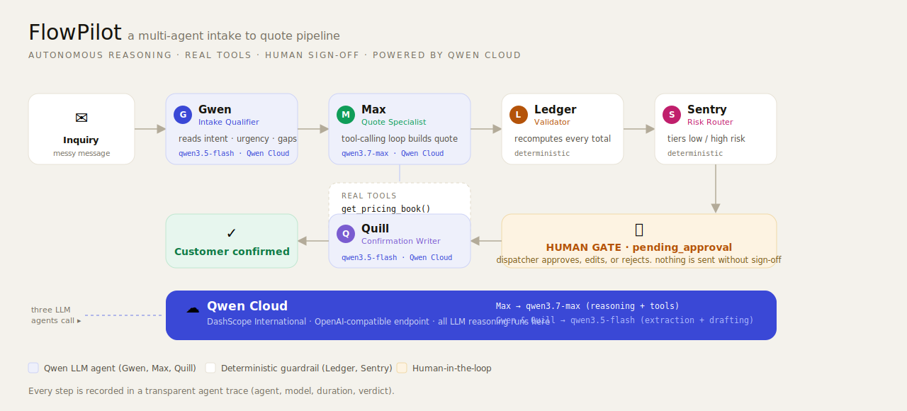

# FlowPilot 🛩️

**An autopilot agent that turns chaotic home-service inquiries into approved quotes in under a minute, with multi-agent reasoning, real tools, and a human sign-off.**

Built for the **Global AI Hackathon Series with Qwen Cloud**, Track 4: Autopilot Agent. All of the reasoning runs on **Qwen Cloud** (`qwen3.7-max` and `qwen3.5-flash`).

---

A messy customer message comes in, something like *"AC blowing warm + rattling, can someone come this week?"* or just *"how much for ac"*. FlowPilot reads it, works out the job and how urgent it is, looks up real pricing and calendar availability, and drafts a quote it can actually defend. It flags every assumption it had to make and tiers the quote by risk. A human dispatcher then reviews it, edits anything they want, and approves. Only after that does FlowPilot send the customer a polished confirmation. Every decision along the way is recorded in a clear, step by step trace.

It isn't a chatbot. It's a worker that finishes a real back-office job.

## The problem

Home-service businesses like HVAC, plumbing, and cleaning lose work to slow quotes. Pricing a single inquiry by hand eats 15 to 30 minutes of a skilled tech's or owner's time, and homeowners tend to hire whoever replies first. The inquiries that go cold are usually the ones that land at night or on a weekend. FlowPilot closes that gap to about 30 seconds while keeping a person firmly in control.

## How it works: a team of agents

FlowPilot is built as a small crew of specialists rather than one giant prompt. Each one has a single job, and they hand work down the line. Two of the steps are plain deterministic code (no AI), which is exactly the point: the safety checks sit between the AI steps, so a number can't reach a customer without being re-verified by hand.



```
inquiry
  1. Gwen    Intake Qualifier     qwen3.5-flash    reads the message into a clean profile
  2. Max     Quote Specialist     qwen3.7-max      autonomous tool-calling loop builds the quote
  3. Ledger  Validator            deterministic    recomputes every total so the math is exact
  4. Sentry  Risk Router          deterministic    tiers the quote low or high risk, and says why
  ================  pending_approval  ·  HUMAN GATE  ================
     the dispatcher approves, edits, or rejects (nothing reaches the customer first)
  5. Quill   Confirmation Writer  qwen3.5-flash    writes and sends the customer email
confirmed
```

Splitting the work this way keeps each call simple and reliable. A cheap, fast model handles the easy jobs while the strong model does the hard tool-using reasoning, and the deterministic Validator catches any arithmetic drift before it ever leaves the building.

### Meet the team

The pipeline is presented as a named crew so the dispatcher always knows who did what. On the approval screen each agent **speaks to you in plain language about that specific client's quote** (for example, *"I re-added every line by hand, the math is exact at $1,580.59"*), and the live trace and working screen show each agent with its own avatar.

| | Agent | What they do |
|---|---|---|
| 📥 **Gwen** | Intake Qualifier | Reads the messy message and pulls out the job, the system, and the urgency |
| 🛠️ **Max** | Quote Specialist | Calls the pricing book and calendar, then builds the itemized quote |
| 🧮 **Ledger** | Validator | Re-checks every number, deterministically, with no LLM math |
| 🛡️ **Sentry** | Risk Router | Tiers the quote low or high and explains the reasons |
| ✍️ **Quill** | Confirmation Writer | Writes the customer's confirmation once you approve |

### Why this fits Track 4

| Rubric criterion | How FlowPilot delivers |
|---|---|
| **Ambiguous inputs** | Infers intent from vague text and surfaces its assumptions instead of guessing silently |
| **External tool use** | `get_pricing_book`, `check_calendar_availability`, and `save_quote`, all chosen by the agent on its own |
| **Human-in-the-loop** | A real `pending_approval` gate, risk-tiered so the dispatcher's attention goes where it counts |
| **End-to-end workflow** | Intake to quote to confirmation, a complete business process |
| **Production-readiness** | Typed state machine, a deterministic validator, a full agent trace, and a one-container deploy |
| **Qwen Cloud** | Every bit of reasoning runs on Qwen via the OpenAI-compatible DashScope endpoint, with real model routing |

## Tech stack

- **Backend:** Python, FastAPI, SQLModel and SQLite, the OpenAI SDK pointed at Qwen Cloud (DashScope International)
- **Frontend:** React, Vite, TypeScript. Light editorial design with a named agent team, a first-person team readout, an animated agent trace, and risk banners
- **Models:** `qwen3.7-max` for reasoning and tools, `qwen3.5-flash` for extraction and drafting
- **Deploy:** a single Docker container (the API serves the built SPA) on Alibaba Cloud ECS

## Run it locally

You need Python 3.12 or newer, Node 20 or newer, and a Qwen Cloud API key.

```bash
# 1. Backend
cd flowpilot/backend
python -m venv .venv && .venv\Scripts\activate      # Windows. On macOS or Linux use: source .venv/bin/activate
pip install -r requirements.txt
copy .env.example .env                               # then put your QWEN_API_KEY in .env
python seed_demo.py                                  # optional, loads 6 demo leads
python -m uvicorn app.main:app --port 8000

# 2. Frontend (second terminal)
cd flowpilot/frontend
npm install
npm run dev
```

Open <http://localhost:5173>. If you'd rather run fully offline, a local **Ollama** fallback is preconfigured in `.env` (see the commented block).

## Deploy to Alibaba Cloud

See **[deploy/alibaba/DEPLOY.md](flowpilot/deploy/alibaba/DEPLOY.md)**. One container, one public URL.

## Repo layout

```
flowpilot/
  backend/   FastAPI app and the multi-agent pipeline (app/agent/), tools, seed and tests
  frontend/  React and Vite SPA (landing page plus the 5-screen app flow)
  Dockerfile, docker-compose.yml   single-container build
  deploy/alibaba/DEPLOY.md         deployment runbook
docs/        architecture diagram and Devpost copy
```

## Get a Qwen Cloud API key

1. Sign up at [home.qwencloud.com](https://home.qwencloud.com/). It's free, no card needed, and you get 1M free tokens per model for 90 days. (The quota can take a day or two to activate.)
2. In Model Studio go to **API Keys** and click **Create API key**.
3. Put it in `flowpilot/backend/.env` as `QWEN_API_KEY`.

## License

MIT, see [LICENSE](LICENSE).
